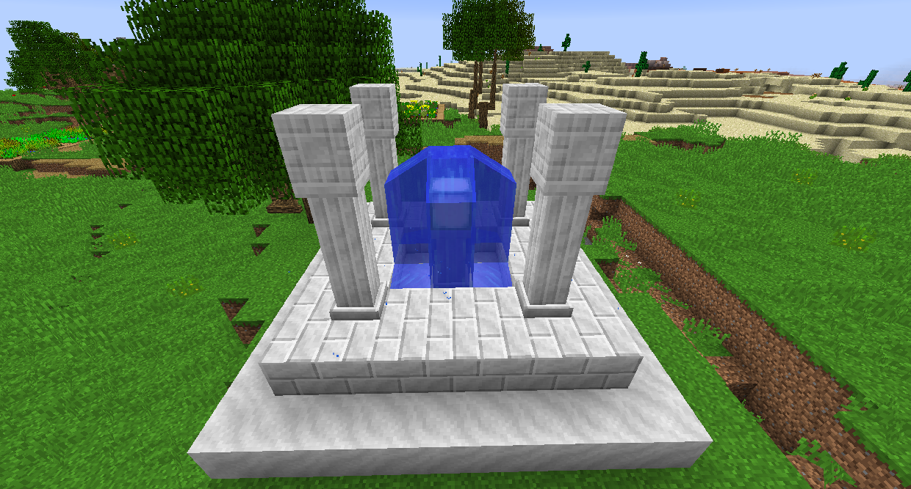

# 建築

許多模組添加了您可以在世界各地找到的建築。

### 浮空島
Tinkers' Construct 添加了漂浮在天空中的史萊姆島。藍色史萊姆生物會生成，殺死它們會掉落藍色史萊姆球。漂浮的史萊姆島分為三種：紫色、藍色和綠色。紫色是最稀有的，你可以在它們上面收集凝固的紫​​色史萊姆塊以獲得紫色史萊姆球，用於製造騎士史萊姆（匠魂工具的材料）。你也可以砍倒史萊姆樹，這會給你史萊姆樹苗，它是史萊姆的無限來源。

### 祭壇
星輝魔法-Astral Sorcery 增加了三種結構：古代神殿、小型神殿和寶藏神殿。
古代神殿在高處生成，是您開始使用星輝魔法的地方，因為它們包含一個浮動水晶。閱讀星芒寶典了解更多信息。

噴泉可以在大多數地方生成。在其中一根柱子下，您可能會發現一個裝有戰利品的寶箱，可能包括一張星圖。

寶藏神殿很少會在地下生成。在中心你可以找到一個方塊，當它被開採時，它會再生為隨機礦石。您可以通過這種方式獲得大量礦石，但最終會耗盡。

### 實用擴展-Actually Additions
實用擴展添加了鬱鬱蔥蔥的洞穴，它們基本上只是地下的小森林。

### 失落廢墟-Additional Structures
Rex's Additional Structures 向世界添加了一堆其他雜項建築。

