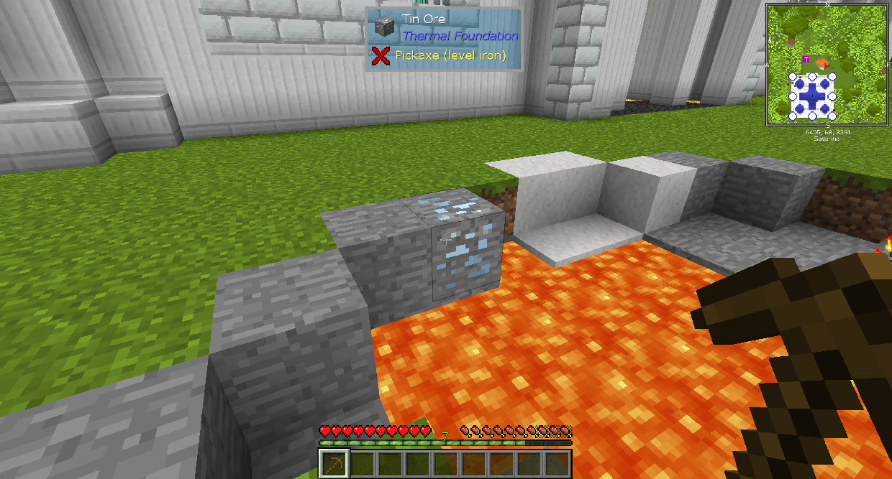

# 你的介面

模組化的 Minecraft 自然與未修改的（vanilla）有很多不同。您可能會注意到的第一件事就是物品欄的變化。

不同的模組包可能彼此不同，這取決於其中的模組及其配置方式。不過，大多數模組包都有這些共同點。

右側的項目列表以及以黃色突出顯示的所有內容均來自 Just Enough Items (JEI)。
左上角的所有內容均來自 FTB 模組。
物品欄右上方的小地圖來自 JourneyMap。

玩家頭像右上角的戒指來自飾品欄模組。單擊它可以讓您將飾品插入特殊插槽。您可以在 JEI 中輸入“Bauble”來查找所有的飾品。

物品欄右上角的“...”按鈕打開物品欄調整設置。您可能永遠不需要打開它。

在您的物品欄之外，當您查看一個方塊時，您可以在屏幕頂部看到該方塊是什麼，以及添加它的模塊。這是由模組 The One Probe 添加的。
它還會告訴您需要什麼工具來破壞它，以及您需要什麼級別的工具。當它說“鎬（級別 鐵）”時，並不意味著它需要鐵鎬。它需要一把可以開採鐵礦石的鎬。
它還可能會告訴您有關您正在查看的方塊的其他信息，例如其中的內容以及它是否正在執行某些操作。

您可以按 F7 來顯示哪些區域足夠暗以供怪物生成。標有黃色 X 的方塊表示怪物可以在夜間生成，紅色 X 表示怪物可以隨時生成。

在生物上方，您可以看到他們當前的生命值、最大生命值以及他們是否有裝甲。

在聊天菜單中，您可以看到全局聊天選項。這使您可以與正在玩此模組包的其他人聊天。當你打開它時，你必須接受它的 EULA（它有一個鏈接），然後如果你接受它會給你規則。

要將玩家添加為好友，請轉到暫停菜單並單擊右上角的“好友列表”按鈕。在好友列表的左下方，您可以看到您的唯一代碼。與您的朋友分享，他們將能夠將您添加到他們的朋友列表中。這將允許您與他們聊天，或加入他們所連接的伺服器。如果您想返回僅查看伺服器的聊天，請單擊聊天菜單中的預設。