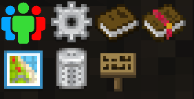
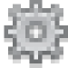
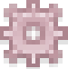
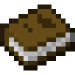
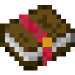
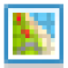
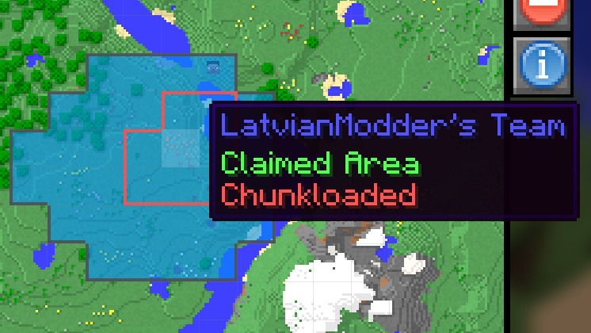
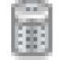

# FTB 模組

左上角的所有內容都是由 FTB 模組添加的，例如 FTB 實用工具、FTB 任務和 FTB 指南。某些按鈕僅在您處於啟用作弊的世界中或在伺服器上處於 OP 狀態時才可用。

此按鈕允許您更改團隊的設置。也就是說，它讓您可以選擇誰在您的團隊中，哪些其他團隊是盟友，哪些其他團隊是敵人。

此按鈕允許您更改客戶端設置。

如果您是伺服器管理員或啟用作弊的單人世界，則此按鈕允許您更改伺服器設置。

此按鈕可打開 FTB 指南菜單。

此按鈕可打開 FTB 任務菜單。

如果您啟用了作弊功能，此按鈕會切換您的遊戲模式。

如果您啟用了作弊功能，此按鈕會切換下雨。

如果您啟用了作弊功能，這些按鈕允許您將時間設置為白天或黑夜。

如果您啟用了作弊，此按鈕會治愈您。

此按鈕會打開一個地圖，您可以在其中為您的團隊聲明區塊。左鍵單擊為您的團隊聲明區塊，右鍵單擊聲明的區塊以取消聲明它們。只有團隊的成員或盟友才能與聲明的區塊中的事物進行交互。您可以按住 shift 並左鍵單擊已聲明的區塊，使它們永久加載(Chunkload)，這樣當附近沒有人時該區塊不會卸載。

此按鈕可打開垃圾桶。您可以將任何物品放入其中，如果您將它們留在裡面並關閉菜單，它們將被永久銷毀。