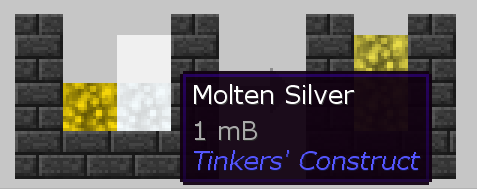
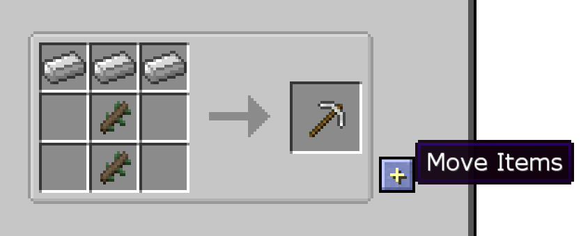

# Just Enough Items

Just Enough Items 添加了所有用黃色框起來的東西。在右側，您可以找到模組包中的每個方塊和物品。預設情況下，您可以單擊任何項目，或將鼠標懸停在該項目上然後按 R，您將看到該項目的製作配方。

在此菜單的左側，您可以看到可以製作該配方的所有內容。在頂部，您可以看到可以製作的所有不同方法。

例如，當您將原木放入鋸木機並為其提供能量（左側的紅色條）時，您可以獲得 6 個木板。

您可以左鍵單擊一個項目，或將鼠標懸停在它上面然後點擊 U，以查看該項目的所有用途。

同樣，在左側，您可以查看使用這些配方的所有東西，而在頂部，您可以查看使用此材料所有不同機器。

使用流體的配方將顯示以 mB 為單位的數量，它代表毫桶。 1000mB 等於一桶該流體。

您可以按配方右側的 + 按鈕將這些物品自動移動到合成台中各自的位置。

底部的文本框是搜索欄。在其中輸入內容以過濾項目列表。您可以鍵入 @ 後以 模組名稱（英文）以僅過濾來自該模組的項目。

您還可以搜索自然生成的方塊以查看它們生成的位置、生物掉落、植物掉落和地牢戰利品。

一些配方使用稱為礦石詞典的東西。這不是方塊或物品，而是一種機制，允許多個物品在某些配方中相互代替。一個例子是需要 銅錠 的機器，這將是來自任何模組的銅錠。JEI 將在礦石詞典中適用於配方的所有項目中輪換，您可以將鼠標懸停在它上面以查看它需要什麼。

您可以將鼠標懸停在項目上並點擊 A 將它們保存到您的書籤項目中，該項目將出現在物品欄的左側並保持在那裡，直到您再次點擊它們。您可以通過單擊左下角的按鈕暫時隱藏書籤。

搜索欄旁邊的扳手按鈕會打開 JEI 的配置菜單，您可以在其中根據需要自定義模組設置。如果您是伺服器管理員或在啟用作弊的世界中，您可以按住 Control 並單擊扳手按鈕以啟用作弊模式。
在作弊模式下，左鍵單擊物品列表中的物品會給你一組該物品，右鍵單擊會給你一個。

當您將鼠標懸停在物品欄或 JEI 中的某個物品上時，您可以在該物品的名稱下方看到它來自哪個模組。

