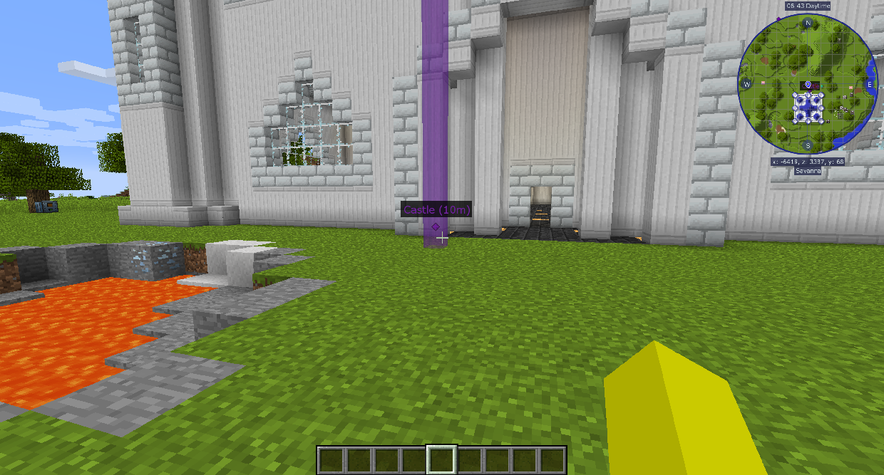
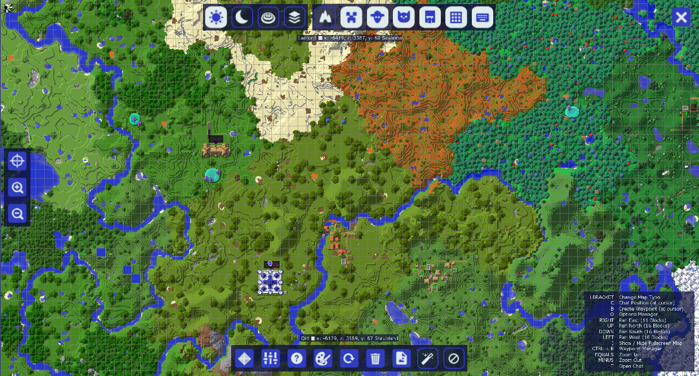
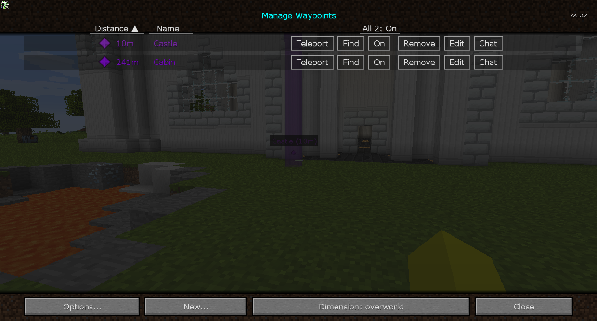

# 旅行地圖-Journeymap

在螢幕的右上角，您可以看到一個小地圖。這會顯示您的周邊區域、附近的玩家和怪物等等。
點擊 B 創建一個定位點。你可以給它一個名字和一個顏色。您可以在世界中以及放置它的小地圖中看到此定位點。

你可以按 Control+J 來切換小地圖。

如果你點擊 J，你會打開地圖。在這裡，您可以鳥瞰所有您去過的地方，以及您放置的任何定位點。

地圖左下角的按鈕打開定位點管理菜單。
